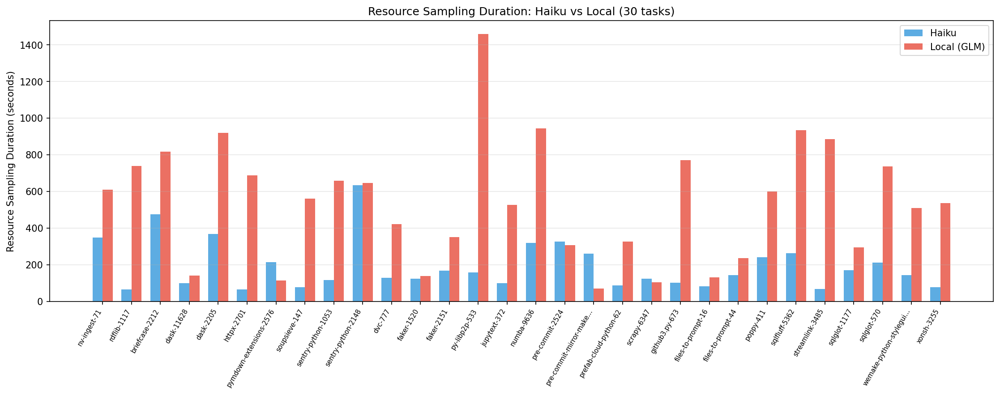
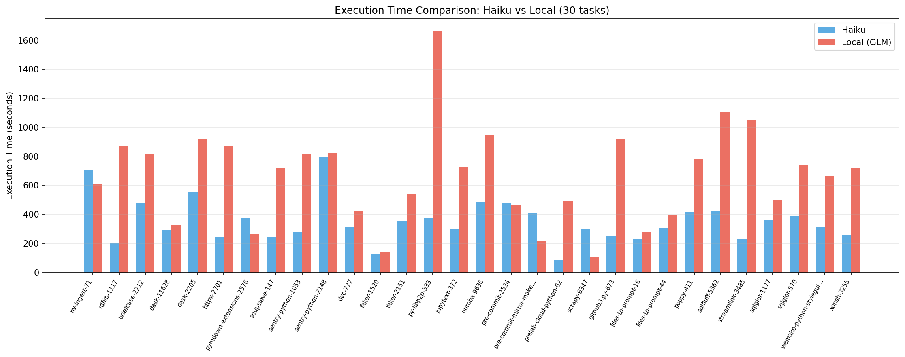
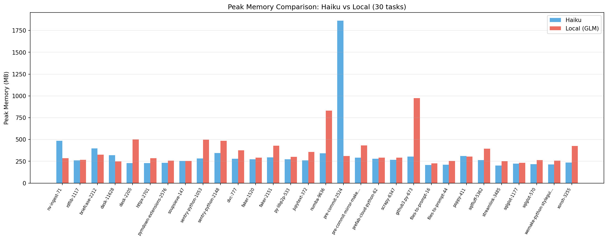
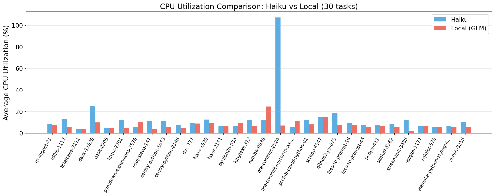
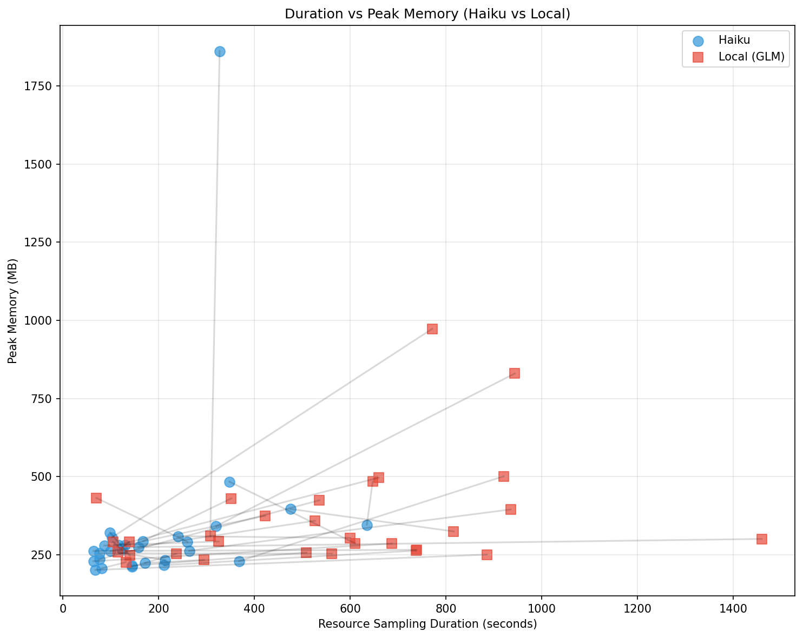
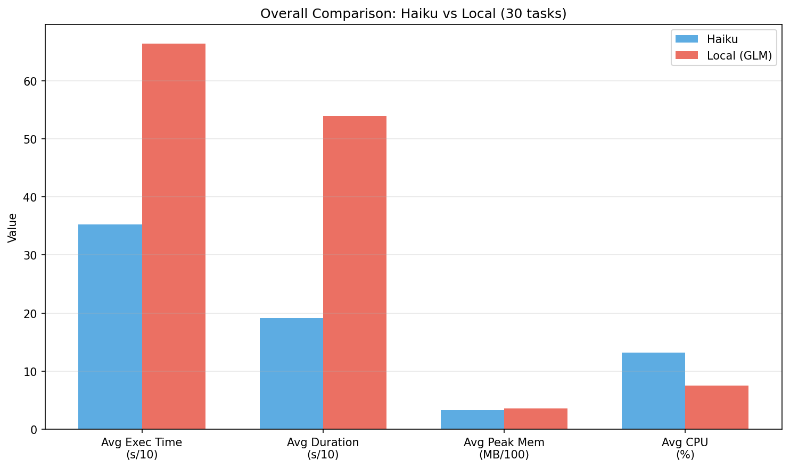

# Haiku vs Local Model (GLM) Comparison Report

**Generated**: 2026-02-07 18:08:27

## Overview

This report compares resource usage between Haiku (cloud API) and Local GLM (on-device GPU) agents
across 30 common SWE-rebench tasks (filtered: sampling duration >= 60s, valid resource data required).

- **Haiku data**: `experiments/all_images_haiku/`
- **Local data**: `experiments/all_images_local/`

## 1. Aggregate Statistics

| Metric | Haiku | Local (GLM) | Ratio |
|--------|-------|-------------|-------|
| Valid tasks | 30 | 30 | - |
| Avg sampling duration | 192s | 539s | 2.81x |
| Avg execution time | 352s | 664s | Local 1.88x |
| Avg peak memory | 328MB | 363MB | Haiku 0.90x |
| Avg CPU utilization | 13.2% | 7.6% | Haiku 1.7x |

## 2. Per-Task Details

| Task | H Duration | L Duration | H Peak Mem | L Peak Mem | H Avg CPU | L Avg CPU |
|------|-----------|-----------|-----------|-----------|----------|----------|
| NVIDIA__nv-ingest-71 | 348s | 610s | 484MB | 287MB | 8.3% | 7.5% |
| RDFLib__rdflib-1117 | 64s | 738s | 262MB | 266MB | 13.1% | 5.5% |
| beeware__briefcase-2212 | 475s | 816s | 396MB | 324MB | 4.3% | 4.0% |
| dask__dask-11628 | 98s | 140s | 321MB | 247MB | 25.2% | 9.9% |
| dask__dask-2205 | 368s | 921s | 229MB | 501MB | 5.1% | 4.5% |
| encode__httpx-2701 | 64s | 687s | 229MB | 286MB | 12.3% | 5.1% |
| facelessuser__pymdown-extensions-2576 | 214s | 115s | 233MB | 258MB | 5.4% | 10.5% |
| facelessuser__soupsieve-147 | 76s | 562s | 254MB | 253MB | 10.9% | 4.0% |
| getsentry__sentry-python-1053 | 116s | 660s | 281MB | 496MB | 11.7% | 6.1% |
| getsentry__sentry-python-2148 | 635s | 647s | 346MB | 484MB | 7.7% | 5.0% |
| iterative__dvc-777 | 130s | 422s | 281MB | 374MB | 9.4% | 8.9% |
| joke2k__faker-1520 | 123s | 138s | 273MB | 292MB | 12.6% | 9.5% |
| joke2k__faker-2151 | 167s | 352s | 293MB | 430MB | 6.4% | 6.2% |
| libp2p__py-libp2p-533 | 158s | 1459s | 274MB | 300MB | 6.7% | 9.1% |
| mwouts__jupytext-372 | 99s | 526s | 262MB | 359MB | 12.0% | 6.6% |
| numba__numba-9636 | 320s | 944s | 342MB | 830MB | 12.2% | 24.8% |
| pre-commit__pre-commit-2524 | 327s | 308s | 1862MB | 310MB | 107.3% | 7.0% |
| pre-commit__pre-commit-mirror-maker-64 | 260s | 70s | 292MB | 432MB | 5.8% | 11.6% |
| prefab-cloud__prefab-cloud-python-62 | 87s | 326s | 279MB | 292MB | 12.3% | 8.1% |
| scrapy__scrapy-6347 | 123s | 104s | 265MB | 292MB | 14.7% | 14.7% |
| sigmavirus24__github3.py-673 | 103s | 771s | 306MB | 973MB | 18.8% | 7.2% |
| simonw__files-to-prompt-16 | 81s | 131s | 206MB | 226MB | 9.8% | 7.2% |
| simonw__files-to-prompt-44 | 144s | 237s | 212MB | 253MB | 7.4% | 6.1% |
| spacetelescope__poppy-411 | 240s | 600s | 309MB | 304MB | 7.2% | 6.6% |
| sqlfluff__sqlfluff-5362 | 264s | 935s | 262MB | 395MB | 8.2% | 5.3% |
| streamlink__streamlink-3485 | 68s | 885s | 201MB | 250MB | 12.1% | 2.3% |
| tobymao__sqlglot-1177 | 171s | 294s | 223MB | 234MB | 6.7% | 6.7% |
| tobymao__sqlglot-570 | 211s | 737s | 216MB | 263MB | 5.6% | 5.4% |
| wemake-services__wemake-python-styleguide-3117 | 144s | 509s | 214MB | 257MB | 6.9% | 5.5% |
| xonsh__xonsh-3255 | 76s | 536s | 235MB | 424MB | 10.5% | 5.5% |

## 3. Key Findings

### Resource Usage Patterns
1. **CPU Utilization**: Haiku avg 13.2% vs Local 7.6% (1.7x difference)
2. **Peak Memory**: Haiku avg 328MB vs Local 363MB
3. API-based agents (Haiku) consume more CPU for network I/O and protocol overhead
4. Local inference agents offload compute to GPU (not captured by cgroup CPU metrics)

### Implications for Resource Management
- Different agent architectures require fundamentally different resource profiles
- Static resource limits cannot accommodate both agent types efficiently
- This heterogeneity reinforces the **domain mismatch** argument

