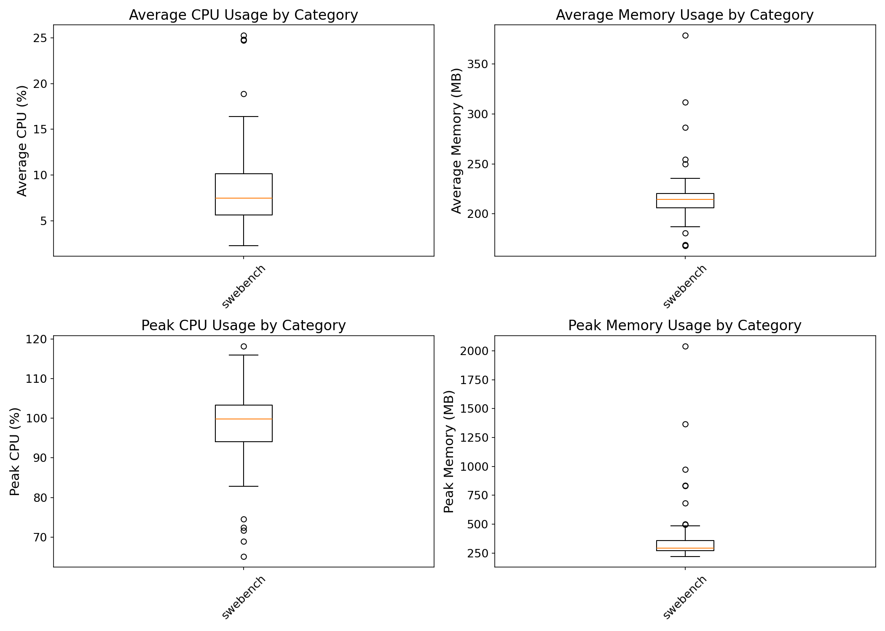
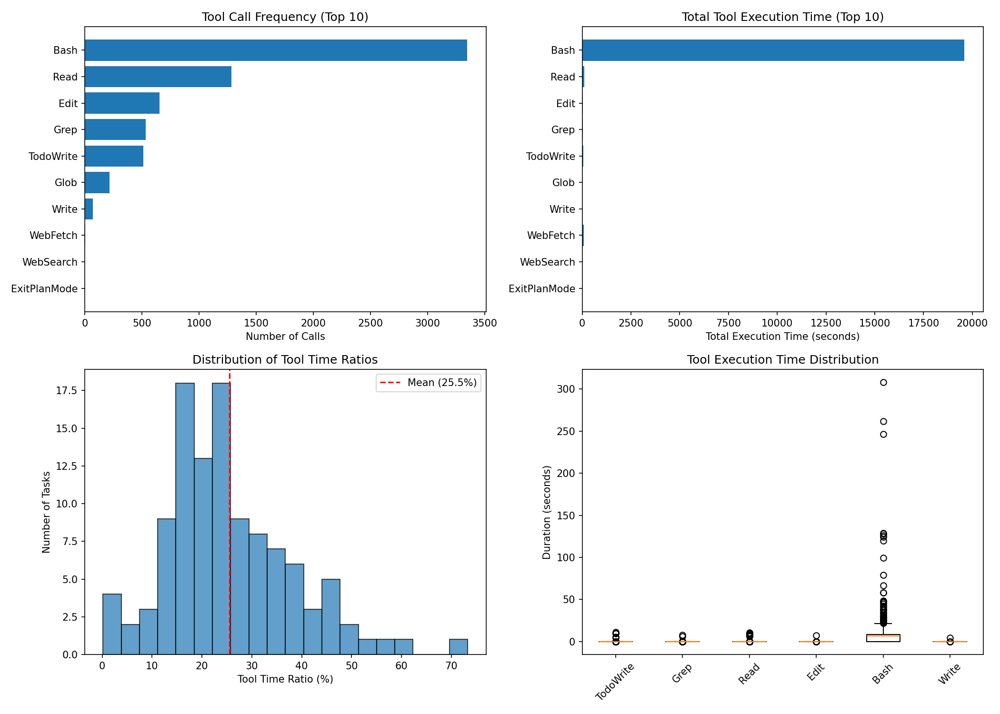
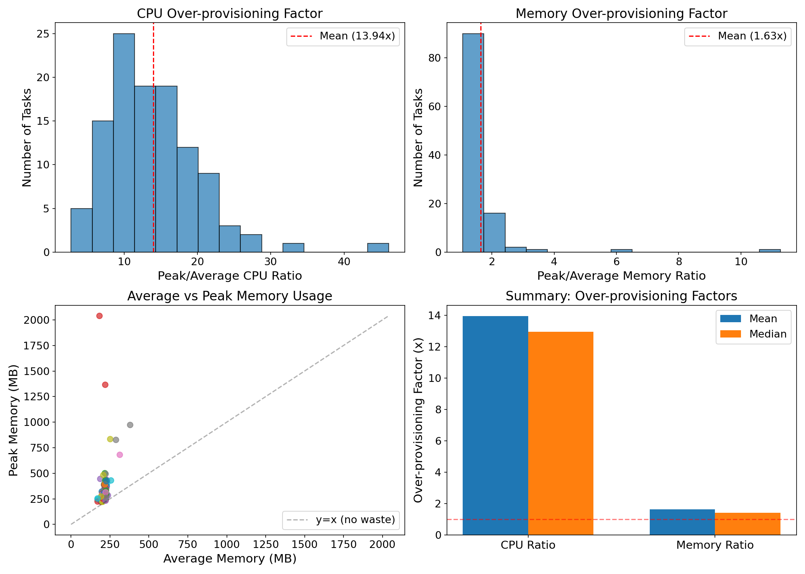

# AgentCgroup SWE-Bench Experiment Analysis Report (qwen3)

Generated: 2026-02-07 18:08:21

Data source: `/home/yunwei37/workspace/agentcgroup/experiments/all_images_local`

Total tasks analyzed: 111

## Dataset Overview

| Metric | Value |
|--------|-------|
| Total tasks | 111 |
| Successful | 60 (54.1%) |
| Total execution time | 74853.0s (1247.5 min) |

## RQ1: Resource Usage Dynamics (Time-scale Mismatch)

**Research Question**: How dynamic are resource changes during AI agent execution?

**Paper Claim**: User-space controllers react in 10-100ms, but resource changes happen at millisecond scale.

### Findings

- **Total burst events detected**: 840
- **Tasks with bursts**: 111 / 111

**CPU Change Rate Statistics (%/sec)**:
- Mean: 0.24
- Max: 50.93
- 95th percentile: 0.39

## RQ2: Resource Usage by Category (Domain Mismatch)

**Research Question**: Do different task categories have significantly different resource needs?

**Paper Claim**: Static resource limits cannot adapt to different workloads.

### Memory Usage by Category

| Category | N | Avg Memory (MB) | Peak Memory (MB) |
|----------|---|-----------------|------------------|
| swebench | 111 | 214.9 | 2041.0 |

## RQ3: Tool Call Patterns

**Research Question**: What is the relationship between tool calls and resource consumption?

### Top Tools by Execution Time

| Tool | Call Count | Total Time (s) | Avg Time (s) |
|------|------------|----------------|--------------|
| Bash | 3343 | 19597.66 | 5.86 |
| Read | 1282 | 100.27 | 0.08 |
| WebFetch | 5 | 77.94 | 15.59 |
| Task | 1 | 67.47 | 67.47 |
| TodoWrite | 514 | 50.50 | 0.10 |
| Grep | 534 | 28.45 | 0.05 |
| Edit | 654 | 27.10 | 0.04 |
| Glob | 217 | 14.49 | 0.07 |
| WebSearch | 2 | 13.59 | 6.79 |
| Write | 71 | 6.82 | 0.10 |

**Tool Time Ratio**: Mean 25.5%, Median 23.1%

## RQ4: Over-provisioning Analysis

**Research Question**: How much over-provisioning would static limits require?

### Over-provisioning Factors

| Metric | CPU Ratio | Memory Ratio |
|--------|-----------|--------------|
| Mean | 13.94x | 1.63x |
| Median | 12.96x | 1.41x |
| Max | 46.11x | 11.27x |
| 95th Percentile | 24.30x | 2.37x |

## Key Conclusions

1. **Time-scale Mismatch**: Resource usage exhibits significant burstiness that exceeds 
   the reaction time of typical user-space controllers.
2. **Domain Mismatch**: Different task categories show distinct resource profiles, 
   making static limits suboptimal.
3. **Over-provisioning Waste**: Static provisioning at peak levels wastes significant resources,
   as average usage is typically much lower than peak.