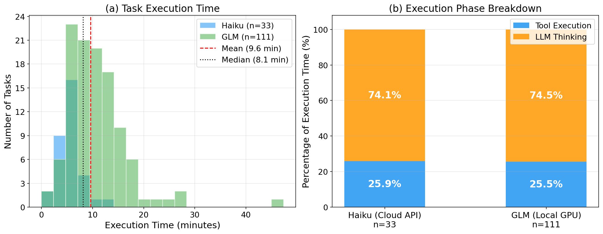
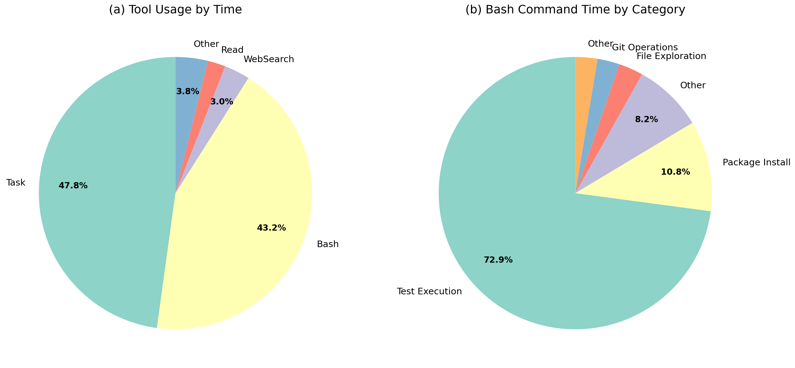

# 3 Characterization and Motivation

我们对生产级 AI coding agent 的资源使用模式进行了首次系统性测量研究，旨在回答以下研究问题：

- **RQ1**: Agent 的执行模型是什么？
- **RQ2**: Agent 工作负载的资源使用有何特征？

并且讨论 AI coding agent 的资源使用模式和传统的容器化工作负载之间的根本差异，以及这些差异对现有资源管理工具的适用性和效率的影响。

## 3.1 Experimental Setup

**实验平台。** 所有实验在一台配备 Intel Core Ultra 9 285K 处理器（24 核，最高 5.8 GHz）、128 GB DDR5 内存的机器上运行，操作系统为 Ubuntu 24.04.3 LTS，内核版本 Linux 6.15.11（已启用 cgroup v2）。每个任务在独立的 Podman 容器中执行，容器镜像来自 SWE-rebench 官方 Docker 镜像（单个镜像大小 2.9–17.3 GB）。characterization 实验期间不对容器施加任何资源限制，以确保测量反映无约束条件下的真实资源需求。

**数据集。** 我们采用两级数据集策略。首先，从 SWE-rebench 数据集中收集 111 个任务（GLM 本地模型）和 33 个任务（Haiku 云端模型），用于大规模统计分析。此外，我们精选 18 个代表性任务，覆盖六个类别（CLI_Tools、DevOps_Build、ML_Scientific、Medical_Bio、SQL_Data、Web_Network）和三个难度级别（Easy、Medium、Hard），用于类别级分析。这些任务涵盖了 AI coding agent 的典型使用场景，包括命令行工具修复、构建系统配置、机器学习代码调试、生物医学数据处理、数据库查询优化和 Web 服务修复。

**Agent 实现。** 所有任务均使用同一 agent 框架——Claude Code 执行，配合两个不同的底层模型：（1）Haiku（云端 API），LLM 推理在 Anthropic 云端执行；（2）GLM 4.7 flash（本地 GPU），LLM 推理通过 GPU 在本地设备上执行。Agent 框架本身（工具调用逻辑、沙箱环境、Node.js 运行时）完全相同，差异仅在于底层模型及其推理位置。选择这两个模型是为了观察不同模型（及其推理位置：远程 API vs 本地 GPU）对容器内资源使用的影响。

**数据收集。** 对于每个任务执行，我们以 1 秒间隔采样每个容器的 CPU 利用率和内存使用量，并记录每个工具调用的类型、开始时间和结束时间。所有任务在相同的沙箱环境中执行，以确保测量的可比性。

## 3.2 RQ1: Agent Execution Model

Agent 的执行过程与传统容器化工作负载存在根本差异。与 serverless/FaaS 处理短暂无状态请求（100ms–2s）不同，每个 agent 任务平均运行约 10 分钟（GLM 平均 10.8 分钟，Haiku 平均 5.8 分钟，中位数 8.1 分钟；见 Fig-exec (a)），并执行有状态的多轮推理和工具调用循环。此外，容器启动存在不可忽视的固定开销，平均需要 26.5 秒（中位数 23.0 秒），最长可达 97 秒。

**约 6 成时间用于推理、4 成用于工具执行，但任务间差异巨大（0%–86%）。** Agent 执行由 LLM 推理和工具调用两个阶段交替组成。如 Fig-exec (b) 所示，在全部 144 个任务（Haiku 33 + GLM 111）中，以 `active_time`（trace 首条到末条记录的时间跨度，排除容器启动开销）为分母，工具执行时间的中位数占比约 35%（Haiku 34.7%、GLM 36.5%），均值为 Haiku 42.5%、GLM 36.4%。两个模型的中位数接近，表明约 6 成时间用于 LLM 思考、4 成时间用于工具执行的阶段划分是 agent 工作负载的共性特征。然而，这一比例在不同任务间差异巨大，范围从 0% 到 86%（中位数 ~36%），如 Fig-tool-time (a) 所示。

**Bash 和 Task 占据工具执行时间的 90% 以上，但不同模型的工具策略截然不同。** 如 Fig-tool-type 所示，以 Haiku agent（33 个任务）为例分析工具调用结构（Fig-tool-type (a)）。Task（子 agent 调用）和 Bash 分别占工具总执行时间的 47.8%（n=17）和 43.2%（n=410），WebSearch/WebFetch 合计约 5%，其余工具（Read、Grep、Edit 等）合计不足 5%。相比之下，GLM agent 几乎完全依赖 Bash 调用（占工具时间的 99.5%，n=3304），不使用 Task 子 agent 和 Web 搜索工具。进一步分析 Bash 命令的语义类别（Fig-tool-type (b)），在 Haiku 中测试执行（pytest、unittest 等）占 Bash 总时间的 72.9%，包安装占 10.8%；GLM 的分布更分散——测试执行 43.7%、Python 片段 26.9%、包安装 10.1%。不同类型的工具调用具有截然不同的资源消耗特征：测试执行通常是 CPU 和内存密集型操作，而文件探索和 Git 操作则相对轻量。

**不同工具类型的执行时间跨越三个数量级。** Haiku 的 Task 子 agent 平均执行时间高达 100.47 秒（n=17），Bash 命令平均 3.76 秒（n=410）；GLM 的 Bash 命令平均 5.93 秒（n=3304）。相比之下，Read（Haiku avg 0.34s / GLM avg 0.08s）和 Edit（Haiku avg 0.05s / GLM avg 0.04s）操作的执行时间快三个数量级。这种差异表明，不同工具类型需要不同的资源配置策略。两个模型的工具策略差异也具有资源管理启示：Haiku 模型通过 Task 子 agent 和 Web 搜索将部分工作分发到外部服务，而 GLM 模型将所有计算集中在本地 Bash 执行，导致更高的本地资源消耗（Bash 总时间 19598s vs Haiku 1543s）。

**工具调用遵循"理解-修改-验证"的时间模式。** 如 Fig-tool-time (b) 所示，将执行过程划分为 10 个等长阶段后分析工具调用分布，我们发现 Read 操作集中在执行早期（前 30%），对应代码理解阶段；Bash 调用在中后期（40-80%）最为密集，对应测试和验证阶段；Edit 操作分布相对均匀，贯穿整个执行过程。这种阶段性特征与软件工程的"理解-修改-验证"工作流吻合，为相位感知资源控制提供了依据。

## 3.3 RQ2: Resource Usage Characteristics

在 RQ1 描述的执行模型之上，本节进一步分析 agent 工作负载的资源使用特征。我们首先给出资源占用的宏观画像，然后从时间动态性、非确定性和异构性三个维度分析其不可预测性。

**内存而非 CPU 是多租户并发密度的决定性瓶颈。** Agent 的平均 CPU 利用率极低（Haiku 13.2%、GLM 7.6%，单核基准），在 24 核实验平台上 CPU 远未饱和。内存才是并发密度的决定性约束：峰值内存可达 2–4GB，128GB 内存按峰值分配仅能支撑 32–64 个实例，此时 CPU 利用率仍不超过总容量的 36%。这种 CPU 大量闲置而内存成为瓶颈的失衡，意味着动态内存管理是提升并发密度的关键——在短暂的内存突发时弹性扩展，在空闲期回收资源以容纳更多并发实例。

**磁盘存储需求远超传统容器化应用。** 如 Fig-resource (a) 所示，在去重后的 114 个独立镜像中，Docker 镜像大小范围从 2.9GB 到 17.3GB，平均 4.1GB，中位数 3.5GB，且高度集中在 3–4GB 区间，仅 GLM 111 个任务的镜像总量即达 456GB，对多租户部署形成显著的存储压力。

**资源消耗呈现 ~185MB 框架基线与工具突发叠加的两层结构。** 如 Fig-resource (b) 所示，Agent 框架本身（如 Claude Code 基于 Node.js 运行时）维持一个不可压缩的内存基线：跨所有 144 个任务，执行前期（前 10% 采样点）的平均内存为 Haiku 183MB、GLM 188MB，中位数约 185MB。即使在 LLM 推理阶段（无工具调用），内存也始终维持在这一基线水平。而资源的剧烈波动几乎完全来自工具调用产生的子进程：测试执行、依赖安装等操作将内存瞬间拉高至 500MB–2GB，随后回落到基线。将所有任务的内存使用归一化到执行进度后聚合分析（Fig-resource (b)），执行前半段（0-50%）内存保持相对稳定的基线（约 185-200MB），而后半段内存呈现上升趋势并伴随更大的方差，与 Bash 密集阶段的资源消耗一致。这意味着在多租户场景下，64 个并发实例仅框架基线就需要约 12GB 内存，而工具突发的叠加才是真正的资源管理挑战。资源控制策略需要区分这两个层面——为框架基线提供稳定保障，同时对工具突发进行弹性调度。

**资源消耗由工具语义而非工具类型决定，同为 Bash 调用可差异 13.7 倍。** 相同类型的工具调用（如 Bash）在不同任务上产生截然不同的资源消耗。例如，在 18 个代表性任务中，Medical_Bio 类别的 Bash 调用平均消耗 4GB 峰值内存，而 Web_Network 类别仅需 291MB，差异达到 13.7 倍。这表明资源需求不是由工具类型决定的，而是由工具执行的具体语义决定的——测试执行、数据加载、模型推理等操作即使都通过 Bash 工具调用，其资源特征也完全不同。这一发现对资源控制策略有重要启示：仅基于工具类型的资源分配是不够的，需要更细粒度的语义感知控制。进一步量化不同 Bash 命令类别的资源突发幅度：测试执行（pytest 等）的 P95 内存 spike 高达 518MB（Haiku）/ 234MB（GLM），平均 CPU spike +3.2%；包安装的 P95 内存 spike 约 233MB；而文件探索和 Git 操作的平均内存 spike 仅为 4.5MB 和 13.5MB。同为 Bash 调用，不同语义类别的内存突发幅度相差两个数量级（518MB vs 4.5MB），为基于命令语义的差异化资源配额提供了直接依据。

这种资源特征的不可预测性源于三个维度：时间动态性、非确定性和异构性。

### 时间动态性

Agent 工作负载的资源使用呈现剧烈的时间波动特征。可以观察到，内存使用在单个采样间隔（1 秒）内变化高达 2.9GB，CPU 利用率出现剧烈波动，峰值超过 100%（多核利用）。资源使用呈现明显的"突发"模式，而非平稳变化。

Fig-timeseries-haiku 和 Fig-timeseries-glm 展示了两个具体任务的资源使用时序作为示例：上方为使用 Haiku agent 执行的 pre-commit/pre-commit#2524 任务，下方为使用 GLM agent 执行的 sigmavirus24/github3.py#673 任务。每张图包含两个子图：上方为 CPU 利用率（蓝色），下方为内存使用（绿色），红色阴影区间标注了工具调用（Bash、Read、Edit 等）的执行时段。可以清晰看到资源突发与工具调用高度对齐——CPU 和内存的尖峰几乎都发生在工具执行期间（如运行测试、安装依赖），而工具调用之间的 LLM 推理阶段资源使用相对平稳。这两个示例也体现了不同模型的典型资源差异：Haiku 任务工具调用较为集中，每次执行伴随明显的 CPU 多核突增（峰值超过 175%）；GLM 任务工具调用更加密集频繁，但 CPU 长期维持低水平（~10%），资源波动主要体现在内存维度。尽管具体的资源曲线因任务而异，但这种由工具调用驱动的"突发-静默"交替模式在两个数据集的所有任务中普遍存在。

**98.5% 的内存突发发生在工具调用期间，资源波动几乎完全由工具执行驱动。** 为量化这一现象，我们将每个资源采样点标注为"工具调用中"或"LLM 推理中"，统计超过 300MB 的内存突发事件的归属。在 Haiku 数据集中，工具调用仅占总采样时间的 50.6%，却包含了 98.5% 的内存突发；GLM 数据集中，工具调用占 35.9% 的时间，包含 67.3% 的内存突发。两个数据集的内存突发集中度均为 1.9 倍——即工具调用期间产生内存突发的概率是其时间占比的近 2 倍。CPU 突发的归因则更加分散：Haiku 中 55.3% 的 CPU 突发发生在工具调用期间，GLM 中仅为 30.2%（GLM 的 CPU 突发主要来自本地 GPU 推理的调度开销）。这种不对称性——内存突发高度集中在工具调用中，而 CPU 突发分布更均匀——意味着内存资源应以工具调用为粒度进行弹性调度，而 CPU 资源需要更广泛的上下文感知。

如 Fig-change-rate 所示，我们观察到最大内存变化率达到 3GB/秒，最大 CPU 变化率超过 50%/秒。显著变化事件占所有采样点的 1.7%–3.8%。

**资源突发仅持续 1-2 秒，峰均比高达 15.4 倍，静态限制无论如何设置都不合理。** 资源突发呈现极端的瞬态性（如 Fig-timeseries-haiku 和 Fig-timeseries-glm 中的尖峰所示）。在 18 个代表性任务中，以 Medical_Bio_Hard 任务为例，峰值内存达到 4060MB，而平均内存仅为 264MB，过度供给因子高达 15.4 倍。关键在于，这个 4GB 的峰值仅持续约 1-2 秒，随后立即回落到 230MB 的基线水平。这种"尖峰"模式意味着：如果按峰值设置静态限制，98% 的时间资源都被浪费；如果按平均值设置，则会在突发时触发 OOM。传统的反应式资源调整无法应对如此短暂的突发。

**CPU 与内存的相关性因任务而异（-0.84 到 +0.50），无法假设同向变化。** 如 Fig-timeseries-haiku 和 Fig-timeseries-glm 所示，CPU 和内存使用之间的相关性呈现显著的任务依赖性。跨所有任务的平均相关系数为 -0.39（范围从 -0.84 到 +0.50），表明大多数任务中 CPU 高峰和内存高峰并不同步出现。部分任务呈现正相关（工具执行阶段同时拉高 CPU 和内存），而另一些任务呈现负相关（CPU 密集阶段的内存需求较低，反之亦然）。这种任务依赖的耦合模式比简单的正/负相关更难应对：资源控制策略无法假设 CPU 和内存需求总是同向变化，必须对两种资源维度进行独立监控和协调管理。

内存峰值集中在执行后半段（均值/中位数约 65% 进度处，见 Fig-resource (b)），但分布范围覆盖整个执行周期，这种不可预测性进一步增加了静态资源分配的难度。

### 非确定性

与传统容器化工作负载不同，agent 工作负载表现出高度的非确定性。即使对完全相同的任务执行多次，资源使用模式和执行结果也会显著不同。我们对同一任务（DevOps_Build_Hard）执行了三次，观察到：执行时间分别为 402 秒、222 秒和 259 秒，差异达到 1.8 倍。更重要的是，三次执行产生了完全不同的解决方案——不同的代码修改、不同的文件变更数量、甚至不同的实现策略。这种非确定性源于 LLM 推理的随机性和 agent 决策路径的多样性，使得基于历史数据预测资源需求变得极其困难。

**85%–97% 的任务包含重试循环，消耗 7%–20% 的执行时间并导致内存逐次积累。** 重试是 agent 工作负载的固有行为：Haiku 数据集中 85%（28/33）的任务包含重试组（连续 3 次以上的 Bash 调用），GLM 数据集中这一比例高达 97%（108/111）。GLM 平均每个任务 3.9 个重试组，最大连续重试达 56 次，重试时间平均占总执行时间的 20.5%（Haiku 为 7.4%）。这种"执行测试—观察失败—修改代码—再次测试"的迭代模式是 agent 的行为签名。更重要的是，每次重试循环保留之前的内存上下文而不清理，导致内存逐渐积累——最极端的案例中，重试导致 502MB 的内存累积不释放。这种行为模式在传统容器化工作负载中罕见，但在 agent 工作负载中普遍存在，且其资源影响无法提前预测。

**LLM 生成的 token 数量无法预测资源消耗。** 分析 Haiku 数据集中每个任务的 output token 总量与其峰值内存的相关性，相关系数仅为 r=−0.14（GLM r=+0.02），基本不存在线性相关。对话轮数与执行时间有中等相关（Haiku r=+0.57，GLM r=+0.82），但与峰值内存几乎无关（Haiku r=+0.02，GLM r=+0.11）。这意味着即使可以预测 agent 会产生多少 token 或多少轮对话，也无法据此预测内存需求——资源消耗主要取决于工具调用的语义，而非 LLM 推理本身的规模。

### 异构性

不同任务和不同模型之间的资源需求存在显著差异。在 18 个代表性任务中，峰值内存需求范围从 197MB 到 4GB，变异系数（CV）达到 147%。ML_Scientific 和 Medical_Bio 类别的任务表现出显著高于 CLI_Tools 或 Web_Network 任务的内存需求，但所有任务都在同一个容器中运行。

Haiku 和 GLM 在相同任务上表现出显著的 CPU 利用率差异（Haiku 平均 13.2%，GLM 平均 7.6%，差异 1.7 倍）。平均执行时间也存在显著差异（Haiku 352 秒，GLM 664 秒）。这一结果表明，资源需求不仅取决于任务本身，还取决于底层模型的选择。

**仅更换底层模型即产生截然不同的资源画像。** 这种 CPU 利用率差异反映的本质问题是：即使 agent 框架完全相同（均为 Claude Code），仅更换底层模型就会产生截然不同的资源画像。Haiku 通过云端 API 推理，API 调用、响应解析和上下文管理消耗较多本地 CPU；GLM 的推理在本地 GPU 上执行，容器内 CPU 负载几乎仅来自工具调用——GLM 容器内仅有 0.5% 的采样点 CPU 利用率超过 50%，而 Haiku 达到 8.2%。即使执行相同任务，两个模型的 CPU 分布、执行时长和内存轨迹也显著不同。这意味着资源管理策略无法基于"agent 工作负载"这一单一类别做静态假设，而必须适配不同模型带来的资源特征差异。
<!-- 
## 3.4 RQ3: Provisioning Efficiency

静态资源分配在 agent 工作负载上表现出严重的效率问题。如果将 CPU 限制设置为峰值需求，Haiku 数据集的实际利用率仅为 9%，浪费 91%；GLM 数据集的实际利用率仅为 7%，浪费 93%。过度供给因子在 CPU 上为 11.1×–13.9×；内存的跨任务聚合过度供给因子为 1.6×–1.7×，但单任务内部峰均比可高达 15.4×（如 Medical_Bio_Hard），表明内存突发的极端性被聚合统计所掩盖。

如 Fig-overprov 所示，静态预算无论如何设置都会产生问题：保守设置（按峰值）导致 91%–93% 的资源浪费；激进设置（按平均）在突发期间导致 OOM 或性能下降。结合 Fig-resource (b) 中的聚合内存轨迹——前半段基线稳定、后半段方差增大——可知阶段感知的动态分配是减少浪费的关键。

**动态分配在 64 并发时可节省 34% 内存，统计复用增益随并发数增长。** 为量化动态资源分配的潜在收益，我们使用全部 144 个任务的真实内存轨迹进行多租户并发模拟：将每个任务的内存轨迹归一化为 100 个采样点，随机选取 N 个任务叠加（随机起始偏移），重复 200 次取均值。静态分配（各实例按峰值之和预留）与动态分配（实际叠加峰值）的对比：N=8 时节省 23.5%（统计复用增益 1.31×），N=16 节省 28.5%（1.40×），N=32 节省 31.8%（1.47×），N=64 节省 34.0%（1.51×）。在 128GB 实验平台上，按峰值静态分配仅能支撑约 62 个并发实例，而按平均内存（193MB）计算可支撑 680 个——这 10 倍的差距正是动态内存管理的优化空间。统计复用增益随并发数增长趋于约 1.5×，表明即使在大规模部署下，动态分配仍能持续提供可观的资源节省。 -->

## 3.5 Summary and Implications

基于以上观察，我们识别出现有资源管理工具在处理 AI agent 工作负载时的两个根本性问题。

**用户空间控制器的响应速度（10-100ms）无法匹配秒级资源突发。** 用户空间资源控制器的典型工作流程是监控资源压力指标（如 PSI、memory.events），做出调整决策，然后写入 cgroup 控制文件。这个循环通常需要 10–100ms。然而，RQ2 的测量表明 agent 工作负载的资源变化发生在秒级甚至更快的时间尺度上。当用户空间控制器观察到内存压力并调整限制时，突发已经导致了 reclaim 风暴或运行队列膨胀。任何基于用户空间监控和 cgroup 文件写入的方法都无法及时响应 agent 工作负载的资源突发。

**容器粒度的静态预算无法表达工具调用级别的动态资源需求。** 现有资源控制在容器粒度设置静态预算（如 Kubernetes resource limits、Docker --memory/--cpus、systemd ResourceControl），但 agent 工作负载需要工具调用级别的动态控制。RQ1 表明 agent 执行由 LLM 推理和工具调用两个阶段交替组成，不同工具类型的执行时间差异达到三个数量级。RQ2 表明资源使用具有时间动态性、非确定性和异构性三重不可预测性。RQ3 表明静态限制导致 91%–93% 的资源浪费。静态资源限制无法适应 agent 工作负载的动态、多相位、非确定性特性。

此外，现有工具缺乏表达相位感知控制（根据 LLM 推理 vs 工具执行阶段调整资源）、工具类型感知控制（根据工具类型如测试执行 vs 文件读取分配资源）和跨资源协调（CPU 与内存策略联动）的能力。

这些差距共同表明：有效的 agent 资源管理需要内核级执行（控制逻辑在内核执行点实现微秒级响应）和动态细粒度控制（资源域与工具调用边界对齐）。这正是 AgentCgroup 的设计动机。
