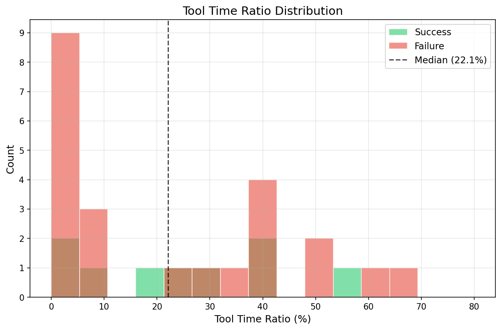
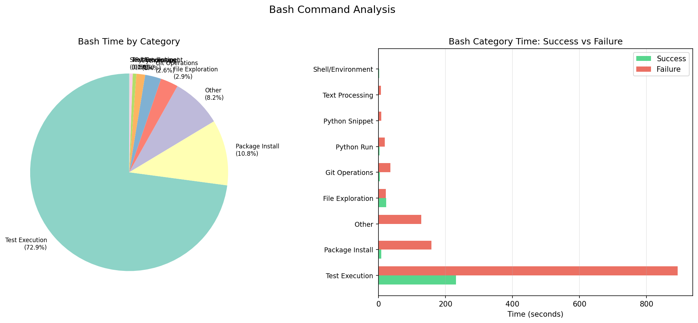
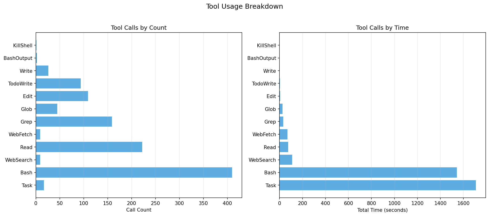
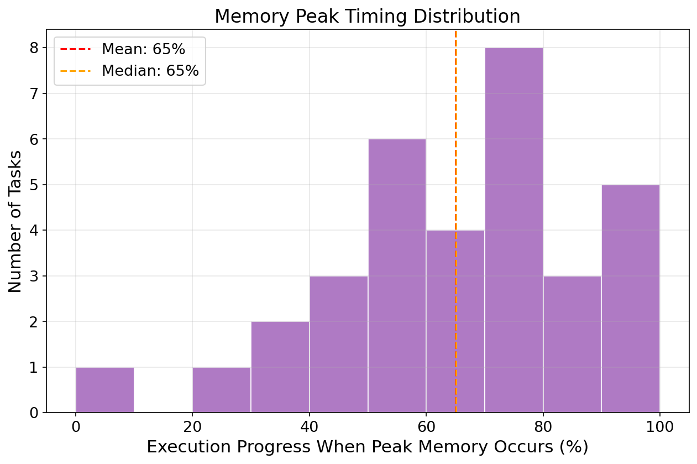
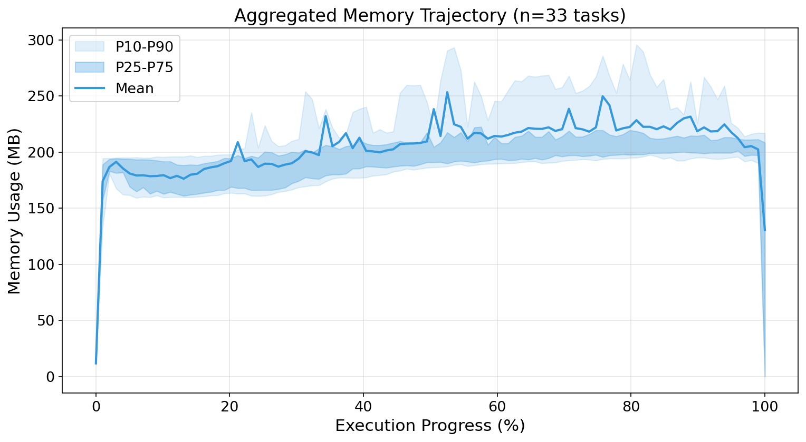

# 3 Characterization

我们对生产级 AI coding agent 的资源使用模式进行了首次系统性测量研究，旨在回答以下研究问题：

- **RQ1**: Agent 的执行模型是什么？
- **RQ2**: Agent 工作负载的资源使用有何特征？为什么难以预测？
- **RQ3**: 静态资源分配的效率如何？

## 3.1 Experimental Setup

**实验平台。** 所有实验在一台配备 Intel Core Ultra 9 285K 处理器（24 核，最高 5.8 GHz）、128 GB DDR5 内存的机器上运行，操作系统为 Ubuntu 24.04.3 LTS，内核版本 Linux 6.15.11（已启用 cgroup v2）。每个任务在独立的 Podman 容器中执行，容器镜像来自 SWE-rebench 官方 Docker 镜像（单个镜像大小 2.9–17.7 GB）。characterization 实验期间不对容器施加任何资源限制，以确保测量反映无约束条件下的真实资源需求。

**数据集。** 我们从 SWE-rebench 数据集中选取 18 个任务，覆盖六个类别（CLI_Tools、DevOps_Build、ML_Scientific、Medical_Bio、SQL_Data、Web_Network）和三个难度级别（Easy、Medium、Hard）。这些任务涵盖了 AI coding agent 的典型使用场景，包括命令行工具修复、构建系统配置、机器学习代码调试、生物医学数据处理、数据库查询优化和 Web 服务修复。

**Agent 实现。** 我们使用两个不同的 agent 实现执行相同的 18 个任务：（1）Claude Code with Haiku，基于云端 API 的生产级 AI coding agent，LLM 推理在 Anthropic 云端执行；（2）Claude Code 连接本地模型 GLM 4.7 flash，LLM 推理通过 GPU 在本地设备上执行。选择这两个 agent 是为了观察不同架构（远程 API 推理 vs 本地 GPU 推理）和推理策略对资源使用的影响。

**数据收集。** 对于每个任务执行，我们通过 `podman stats`（`--no-stream` 模式）以 1 秒间隔采样每个容器的 CPU 利用率和内存使用量，并记录每个工具调用的类型、开始时间和结束时间。所有任务在相同的沙箱环境中执行，以确保测量的可比性。

## 3.2 RQ1: Agent Execution Model

Agent 的执行过程与传统容器化工作负载存在根本差异。与 serverless/FaaS 处理短暂无状态请求（100ms–2s）不同，每个 agent 任务平均运行约 10 分钟，并执行有状态的多轮推理和工具调用循环。

**磁盘与启动开销。** Agent 工作负载对存储资源的需求远超传统容器化应用。在我们的 115 个任务数据集中，Docker 镜像大小范围从 2.9GB 到 17.7GB，平均 4.2GB，中位数 3.5GB。整个数据集的镜像总量达到 469GB。这种存量需求对多租户部署形成显著的存储压力。此外，容器启动存在不可忽视的固定开销：权限修复（permission fix）平均需要 28.3 秒，最长可达 97 秒。这意味着即使镜像已缓存（pull time < 1s），仍需近半分钟的初始化时间才能开始执行任务。

**阶段划分。** Agent 执行由 LLM 推理和工具调用两个阶段交替组成。在所有任务中，工具执行时间平均占总执行时间的 28.2%，LLM 思考时间占 71.8%。然而，这一比例在不同任务间差异巨大，范围从 0.1% 到 73.3%。

**工具类型分布。** 测试执行（pytest、unittest 等）占 Bash 总时间的 44.1%，是最耗时的操作类别。Python 代码片段执行占 26.7%，包安装占 10.9%。不同类型的工具调用具有截然不同的资源消耗特征：测试执行通常是 CPU 和内存密集型操作，而文件探索（6.2%）和 Git 操作（2.1%）则相对轻量。

**工具语义决定资源消耗。** 值得注意的是，相同类型的工具调用（如 Bash）在不同任务上产生截然不同的资源消耗。例如，Medical_Bio 类别的 Bash 调用平均消耗 4GB 峰值内存，而 Web_Network 类别仅需 291MB，差异达到 13.7 倍。这表明资源需求不是由工具类型决定的，而是由工具执行的具体语义决定的——测试执行、数据加载、模型推理等操作即使都通过 Bash 工具调用，其资源特征也完全不同。这一发现对资源控制策略有重要启示：仅基于工具类型的资源分配是不够的，需要更细粒度的语义感知控制。

**工具执行时间差异。** Bash 命令平均执行时间为 2.64 秒，而 Task（子 agent 调用）平均执行时间高达 66.16 秒。相比之下，Read 和 Edit 操作的平均执行时间仅为 0.06 秒和 0.04 秒。这种三个数量级的差异表明，不同工具类型需要不同的资源配置策略。

**工具使用的时间分布。** 将执行过程划分为 10 个等长阶段后分析工具调用分布，我们发现 Read 操作集中在执行早期（前 30%），对应代码理解阶段；Bash 调用在中后期（40-80%）最为密集，对应测试和验证阶段；Edit 操作分布相对均匀，贯穿整个执行过程。这种时间分布模式与软件工程的"理解-修改-验证"工作流一致，但资源需求在各阶段差异显著。

## 3.3 RQ2: Resource Unpredictability

Agent 工作负载的资源使用难以预测，这种不可预测性源于三个维度：时间动态性、非确定性和异构性。

### 时间动态性

Agent 工作负载的资源使用呈现剧烈的时间波动特征。可以观察到，内存使用在单个采样间隔（1 秒）内变化高达 2.9GB，CPU 利用率出现剧烈波动，峰值超过 100%（多核利用）。资源使用呈现明显的"突发"模式，而非平稳变化。

我们观察到最大内存变化率达到 3GB/秒，最大 CPU 变化率超过 50%/秒。显著变化事件（CPU 变化超过 20% 或内存变化超过 50MB/秒）占所有采样点的 1.6%–4.1%。

**瞬态突发特征。** 资源突发呈现极端的瞬态性。以 Medical_Bio_Hard 任务为例，峰值内存达到 4060MB，而平均内存仅为 264MB，过度供给因子高达 15.4 倍。关键在于，这个 4GB 的峰值仅持续约 1-2 秒，随后立即回落到 230MB 的基线水平。这种"尖峰"模式意味着：如果按峰值设置静态限制，98% 的时间资源都被浪费；如果按平均值设置，则会在突发时触发 OOM。传统的反应式资源调整无法应对如此短暂的突发。

**CPU 与内存的正相关性。** 与直觉相反，我们观察到 CPU 和内存使用呈现强正相关（相关系数 91-95%）。这挑战了"LLM 思考阶段资源消耗低、工具执行阶段资源消耗高"的简化模型。实际上，内存积累发生在活跃的认知处理期间，而非空闲思考阶段。当 CPU 利用率下降时，内存通常也同步释放；当 CPU 飙升时，内存也随之增长。这种耦合性表明，资源控制需要同时协调 CPU 和内存策略，而非独立管理。

内存峰值可能出现在执行的任何阶段——早期（前 1/3）、中期（中间 1/3）或后期（后 1/3）。这种不可预测性进一步增加了静态资源分配的难度。

### 非确定性

与传统容器化工作负载不同，agent 工作负载表现出高度的非确定性。即使对完全相同的任务执行多次，资源使用模式和执行结果也会显著不同。我们对同一任务（DevOps_Build_Hard）执行了三次，观察到：执行时间分别为 402 秒、222 秒和 259 秒，差异达到 1.8 倍。更重要的是，三次执行产生了完全不同的解决方案——不同的代码修改、不同的文件变更数量、甚至不同的实现策略。这种非确定性源于 LLM 推理的随机性和 agent 决策路径的多样性，使得基于历史数据预测资源需求变得极其困难。

**重试循环模式。** 我们观察到一种显著的行为模式：高迭代任务表现出 20-51 个"重试组"（连续 3 次以上的 Bash 调用）。例如，Medical_Bio_Hard 任务在 89 次工具调用中包含 51 个重试组，Bash 工具调用密度达到 61.8%。这种模式是迭代式失败恢复的行为签名——agent 反复执行测试、观察失败、修改代码、再次测试。每次重试循环都会保留之前的内存上下文而不清理，导致内存逐渐积累。这种行为模式在传统容器化工作负载中罕见，但在 agent 工作负载中普遍存在。

### 异构性

不同任务和不同 agent 之间的资源需求存在显著差异。峰值内存需求范围从 197MB 到 4GB，变异系数（CV）达到 147%。ML_Scientific 和 Medical_Bio 类别的任务表现出显著高于 CLI_Tools 或 Web_Network 任务的内存需求，但所有任务都在同一个容器中运行。

Haiku 和 Qwen agent 在相同 18 个任务上表现出 3.9 倍的 CPU 利用率差异（Haiku 平均 30.6%，Qwen 平均 7.9%）。平均执行时间也存在显著差异（Haiku 400 秒，Qwen 607 秒）。这一结果表明，资源需求不仅取决于任务本身，还取决于 agent 的架构和实现。

**本地推理 vs API 推理的资源特征差异。** 这种 CPU 利用率差异揭示了一个重要的架构性区别。Haiku 通过 API 调用远程模型，LLM 推理在云端执行，但 API 调用、响应解析和上下文管理仍消耗本地 CPU 资源。相比之下，Qwen 作为本地部署的模型，LLM 推理主要在 GPU 上执行，容器内的 CPU 负载仅来自工具调用。这导致 Qwen 容器内仅有 0.5% 的采样点 CPU 利用率超过 50%，而 Haiku 达到 21.2%。对于资源管理而言，这意味着：API-based agent 需要更多 CPU 配额来处理网络 I/O 和协议开销；本地推理 agent 的瓶颈转移到 GPU，但 GPU 资源目前不在 cgroup 控制范围内。这种架构异构性进一步增加了统一资源管理的难度。

基于平均 CPU 利用率，Haiku agent 理论上可以并发运行约 3 个实例，Qwen agent 可以并发运行约 12 个实例。然而，由于资源突发和非确定性的存在，实际并发能力会受到峰值资源需求的限制。这揭示了理论并发能力与实际可达并发能力之间的巨大鸿沟：如果按峰值内存分配，单机可能仅能运行 1-2 个 agent 实例；但如果能够动态调整资源，同一机器可以支持 3-12 倍的并发度提升。

## 3.4 RQ3: Provisioning Efficiency

静态资源分配在 agent 工作负载上表现出严重的效率问题。如果将 CPU 限制设置为峰值需求，Haiku 数据集的实际利用率仅为 24%，浪费 76%；Qwen 数据集的实际利用率仅为 7%，浪费 93%。过度供给因子在 CPU 上为 4.1×–13.6×，在内存上为 1.6×–2.4×。

静态预算无论如何设置都会产生问题：保守设置（按峰值）导致 76%–93% 的资源浪费；激进设置（按平均）在突发期间导致 OOM 或性能下降。

**聚合内存轨迹。** 将所有任务的内存使用归一化到执行进度（0-100%）后聚合分析，我们观察到一个有趣的模式：执行前半段（0-50%）内存保持相对稳定的基线（约 200MB），而后半段（50-100%）内存呈现上升趋势并伴随更大的方差。这表明 agent 在执行前期进行探索性操作（读取文件、理解代码），而后期进入实际修改和测试阶段，涉及更多数据加载和中间结果积累。这种阶段性特征为相位感知资源控制提供了依据。

## 3.5 Summary and Implications

基于以上观察，我们识别出现有资源管理工具在处理 AI agent 工作负载时的两个根本性问题。

**时间尺度不匹配。** 用户空间资源控制器的典型工作流程是监控资源压力指标（如 PSI、memory.events），做出调整决策，然后写入 cgroup 控制文件。这个循环通常需要 10–100ms。然而，RQ2 的测量表明 agent 工作负载的资源变化发生在秒级甚至更快的时间尺度上。当用户空间控制器观察到内存压力并调整限制时，突发已经导致了 reclaim 风暴或运行队列膨胀。任何基于用户空间监控和 cgroup 文件写入的方法都无法及时响应 agent 工作负载的资源突发。

**域不匹配。** 现有资源控制在容器粒度设置静态预算（如 Kubernetes resource limits、Docker --memory/--cpus、systemd ResourceControl），但 agent 工作负载需要工具调用级别的动态控制。RQ1 表明 agent 执行由 LLM 推理和工具调用两个阶段交替组成，不同工具类型的执行时间差异达到三个数量级。RQ2 表明资源使用具有时间动态性、非确定性和异构性三重不可预测性。RQ3 表明静态限制导致 76%–93% 的资源浪费。静态资源限制无法适应 agent 工作负载的动态、多相位、非确定性特性。

此外，现有工具缺乏表达相位感知控制（根据 LLM 推理 vs 工具执行阶段调整资源）、工具类型感知控制（根据工具类型如测试执行 vs 文件读取分配资源）和跨资源协调（CPU 与内存策略联动）的能力。

这些差距共同表明：有效的 agent 资源管理需要内核级执行（控制逻辑在内核执行点实现微秒级响应）和动态细粒度控制（资源域与工具调用边界对齐）。这正是 AgentCgroup 的设计动机。
